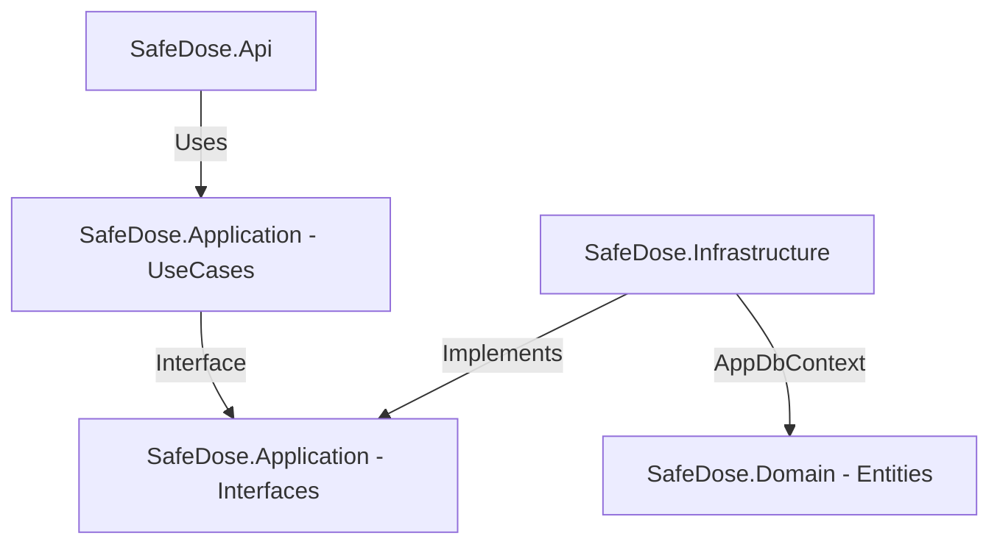

# خطة تنفيذ API الروشتات (Prescription Parse & Save Workflow)

مرحباً بك! هذه الخطة تفصل الخطوات الكاملة لبناء الـ API الخاص بـ Workflow قراءة وتخزين الروشتات الطبية باستخدام الذكاء الاصطناعي (Langflow) وحفظ البيانات في قاعدة البيانات الـ SQL الخاصة بالمشروع.

بما أن المشروع مبني بـ **Clean Architecture (.NET 10)**، فسنقوم بتقسيم التعديلات والإضافات على الطبقات الأربعة (Domain, Application, Infrastructure, API) لضمان فصل المسؤوليات وبنية كود احترافية.

---

## 📌 ملخص Workflow العمليات

1. **التحليل (Parse Prescription):**
   - يقوم الـ Frontend بإرسال صورة الروشتة إلى الـ Backend (`POST /api/prescriptions/parse`).
   - يقوم الـ Backend باستخراج الصورة، ثم إرسالها إلى الـ Langflow API المخصص لقراءة الروشتات باستخدام الـ API Key و URL الخاصين بـ Langflow Prescription.
   - يقوم الـ AI Agent (داخل Langflow) بمطابقة أسماء الأدوية مع قاعدة بيانات الأدوية المصرية (Egyptian Drugs DB) للتأكد من صحتها.
   - يرجع الـ AI البيانات كاملة للـ Backend، والذي بدوره يعيدها للـ Frontend كـ JSON (`ParsedPrescriptionDto`).
   - يحتوي الـ DTO على حقل `NeedsReview` لكل دواء ليوضح للـ Frontend ما إذا كان الـ Agent غير متأكد من الاسم.

2. **الحفظ والتأكيد (Save Prescription):**
   - يقوم الـ Frontend بعرض البيانات وتعبئتها تلقائياً في الشاشة للـ User (أو الطبيب).
   - بعد المراجعة والتعديل إذا لزم الأمر، يضغط الـ User على **Save**.
   - يرسل الـ Frontend البيانات المعدلة إلى الـ Backend (`POST /api/prescriptions/save`).
   - يقوم الـ Backend بحفظ البيانات في الـ SQL Server المحلي في جداول `Prescriptions` و `Drugs` و `PatientMedications` بشكل متزامن وبداخل Transaction واحدة لضمان سلامة البيانات (Atomicity).

---

## 🛠️ تفاصيل التغييرات والملفات المطلوبة



---

## 1. طبقة الـ Application (`SafeDose.Application`)

في هذه الطبقة سنقوم بتعريف عقود الخدمات (Interfaces) التي سينفذها الـ Infrastructure، وبناء حالات الاستخدام (Use Cases) التي ستتحكم في سير البيانات.

### 📄 [NEW] [ILangflowPrescriptionClient.cs](file:///e:/1%20iti.net/1%20Final%20Project/Project/SafeDose-AI-/SafeDose-AI/backend/src/SafeDose.Application/Interfaces/ILangflowPrescriptionClient.cs)
هذا العقد سيمثل الخدمة المنفصلة المسؤولة عن التواصل مع Langflow الخاص بالروشتات (مع API Key و Flow URL منفصلين كما طلبت).

```csharp
using Microsoft.AspNetCore.Http;
using SafeDose.Application.DTOs.PrescriptionDTOs;

namespace SafeDose.Application.Interfaces;

public interface ILangflowPrescriptionClient
{
    // يستقبل الملف المرفوع ويرسله إلى Langflow
    Task<ParsedPrescriptionDto> ParsePrescriptionAsync(IFormFile imageFile);
    
    // بديل في حال أردت تمرير رابط الصورة المرفوعة مسبقاً بدلاً من إرسال الملف مباشرة
    Task<ParsedPrescriptionDto> ParsePrescriptionByUrlAsync(string imageUrl);
}
```

---

### 📄 [NEW] [IPrescriptionRepository.cs](file:///e:/1%20iti.net/1%20Final%20Project/Project/SafeDose-AI-/SafeDose-AI/backend/src/SafeDose.Application/Interfaces/IPrescriptionRepository.cs)
عقد المستودع الخاص بحفظ وتخزين الروشتة والأدوية المرتبطة بها في قاعدة بيانات SQL.

```csharp
using SafeDose.Domain.Entities;

namespace SafeDose.Application.Interfaces;

public interface IPrescriptionRepository
{
    Task<int> SavePrescriptionWithDrugsAsync(Prescription prescription);
}
```

---

### 📄 [NEW] [ParsePrescriptionUseCase.cs](file:///e:/1%20iti.net/1%20Final%20Project/Project/SafeDose-AI-/SafeDose-AI/backend/src/SafeDose.Application/UseCases/ParsePrescriptionUseCase.cs)
حالة استخدام لقراءة الروشتة من الصورة عبر خدمة Langflow.

```csharp
using Microsoft.AspNetCore.Http;
using SafeDose.Application.DTOs.PrescriptionDTOs;
using SafeDose.Application.Interfaces;

namespace SafeDose.Application.UseCases;

public class ParsePrescriptionUseCase
{
    private readonly ILangflowPrescriptionClient _langflowClient;

    public ParsePrescriptionUseCase(ILangflowPrescriptionClient langflowClient)
    {
        _langflowClient = langflowClient;
    }

    public async Task<ParsedPrescriptionDto> ExecuteAsync(IFormFile imageFile)
    {
        if (imageFile == null || imageFile.Length == 0)
        {
            throw new ArgumentException("Prescription image file is required.");
        }

        return await _langflowClient.ParsePrescriptionAsync(imageFile);
    }
}
```

---

### 📄 [NEW] [SavePrescriptionUseCase.cs](file:///e:/1%20iti.net/1%20Final%20Project/Project/SafeDose-AI-/SafeDose-AI/backend/src/SafeDose.Application/UseCases/SavePrescriptionUseCase.cs)
حالة استخدام لحفظ الروشتة والأدوية وجدول المواعيد بعد مراجعة المستخدم.

```csharp
using SafeDose.Application.DTOs.PrescriptionDTOs;
using SafeDose.Application.Interfaces;
using SafeDose.Domain.Entities;

namespace SafeDose.Application.UseCases;

public class SavePrescriptionUseCase
{
    private readonly IPrescriptionRepository _prescriptionRepository;
    private readonly IPatientRepository _patientRepository;

    public SavePrescriptionUseCase(
        IPrescriptionRepository prescriptionRepository,
        IPatientRepository patientRepository)
    {
        _prescriptionRepository = prescriptionRepository;
        _patientRepository = patientRepository;
    }

    public async Task<int> ExecuteAsync(SavePrescriptionDto dto, string accountId)
    {
        // 1. التأكد من أن المريض موجود ومسجل
        var patient = await _patientRepository.GetByIdAsync(dto.PatientId);
        if (patient == null)
        {
            throw new KeyNotFoundException("Patient not found.");
        }

        // 2. رسم خريطة الروشتة (Map DTO to Entity)
        var prescription = new Prescription
        {
            PatientId = dto.PatientId,
            PrescriptionName = dto.PrescriptionName,
            ImageUrl = dto.ImageUrl,
            AccountId = accountId,
            CreatedAt = DateTime.UtcNow,
            SourceType = 1, // مثلاً 1 يعني تم رفعها كصورة وجرى تحليلها بالـ AI
            OCRStatus = 2  // مثلاً 2 يعني مكتملة ومؤكدة (Confirmed)
        };

        // 3. إضافة الأدوية وجدول المواعيد المرتبطة بها
        foreach (var drugDto in dto.Drugs)
        {
            var drug = new Drug
            {
                DrugName = drugDto.DrugName,
                Dose = drugDto.Dose,
                DoctorName = drugDto.DoctorName,
                Route = drugDto.Route,
                AccountId = accountId
            };

            var patientMedication = new PatientMedication
            {
                PatientId = dto.PatientId,
                Dose = drugDto.Dose,
                Frequency = drugDto.Frequency,
                StartDate = drugDto.StartDate,
                EndDate = drugDto.EndDate,
                MealTiming = drugDto.MealTiming,
                Status = 1, // 1 يعني نشط (Active)
                AccountId = accountId,
                Drug = drug // ربط العلاقة (1 to 1) مع الكيان الجديد للـ Drug
            };

            drug.PatientMedication = patientMedication;
            prescription.Drugs.Add(drug);
        }

        // 4. حفظ البيانات كاملة في خطوة واحدة
        return await _prescriptionRepository.SavePrescriptionWithDrugsAsync(prescription);
    }
}
```

---

## 2. طبقة الـ Infrastructure (`SafeDose.Infrastructure`)

في هذه الطبقة نقوم بإنشاء المكونات الخارجية: المستودعات التي تتصل بـ SQL Server عبر EF Core، والعميل (HttpClient) المخصص للاتصال بـ Langflow.

### 📄 [NEW] [LangflowPrescriptionClient.cs](file:///e:/1%20iti.net/1%20Final%20Project/Project/SafeDose-AI-/SafeDose-AI/backend/src/SafeDose.Infrastructure/ExternalServices/LangflowPrescriptionClient.cs)
سوف نستخدم `HttpClient` للاتصال بـ Langflow. يحتوي الكود أدناه على إرسال الـ image كـ multipart content أو تحويلها كـ Base64 أو رفعها لـ Langflow. سنعتمد الطريقة المباشرة الموصى بها في Langflow: رفع الصورة إلى الـ Upload endpoint الخاص بالـ Flow واستخدام الـ File Path الناتج لتمريره كمدخل للـ Agent.

```csharp
using Microsoft.AspNetCore.Http;
using Microsoft.Extensions.Configuration;
using SafeDose.Application.DTOs.PrescriptionDTOs;
using SafeDose.Application.Interfaces;
using System.Net.Http.Headers;
using System.Net.Http.Json;
using System.Text.Json;

namespace SafeDose.Infrastructure.ExternalServices;

public class LangflowPrescriptionClient : ILangflowPrescriptionClient
{
    private readonly HttpClient _httpClient;
    private readonly string _apiKey;
    private readonly string _flowUrl;

    public LangflowPrescriptionClient(HttpClient httpClient, IConfiguration configuration)
    {
        _httpClient = httpClient;
        
        // جلب الإعدادات الخاصة بـ Langflow للروشتة
        _apiKey = configuration["LangflowPrescription:ApiKey"] 
            ?? throw new InvalidOperationException("LangflowPrescription ApiKey is missing");
        _flowUrl = configuration["LangflowPrescription:FlowUrl"] 
            ?? throw new InvalidOperationException("LangflowPrescription FlowUrl is missing");
    }

    public async Task<ParsedPrescriptionDto> ParsePrescriptionAsync(IFormFile imageFile)
    {
        // 1. تحويل الـ image إلى Stream لإرسالها
        using var stream = imageFile.OpenReadStream();
        var fileContent = new StreamContent(stream);
        fileContent.Headers.ContentType = new MediaTypeHeaderValue(imageFile.ContentType);

        // 2. تجهيز الطلب لـ Langflow
        // يرجى الانتباه: قد يتطلب Langflow تمرير الصورة كـ Base64 أو رفعها على Endpoint مخصص للحصول على URL.
        // سنفترض هنا إرسال الملف مباشرة لـ Langflow API.
        using var formData = new MultipartFormDataContent();
        formData.Add(fileContent, "file", imageFile.FileName);

        var request = new HttpRequestMessage(HttpMethod.Post, _flowUrl);
        request.Headers.Authorization = new AuthenticationHeaderValue("Bearer", _apiKey);
        request.Content = formData;

        var response = await _httpClient.SendAsync(request);
        response.EnsureSuccessStatusCode();

        // 3. قراءة النتيجة وتحويلها لـ ParsedPrescriptionDto
        var responseContent = await response.Content.ReadAsStringAsync();
        
        // نقوم بعمل Parse للـ JSON الراجع من Langflow لاستخلاص البيانات
        return MapLangflowResponseToDto(responseContent);
    }

    public async Task<ParsedPrescriptionDto> ParsePrescriptionByUrlAsync(string imageUrl)
    {
        // في حال تم رفع الصورة مسبقاً إلى Cloudinary أو Firebase من الـ Frontend
        var request = new HttpRequestMessage(HttpMethod.Post, _flowUrl);
        request.Headers.Authorization = new AuthenticationHeaderValue("Bearer", _apiKey);

        var requestBody = new
        {
            input_value = imageUrl,
            input_type = "chat",
            output_type = "chat",
            tweaks = new { }
        };

        request.Content = JsonContent.Create(requestBody);

        var response = await _httpClient.SendAsync(request);
        response.EnsureSuccessStatusCode();

        var responseContent = await response.Content.ReadAsStringAsync();
        return MapLangflowResponseToDto(responseContent);
    }

    private ParsedPrescriptionDto MapLangflowResponseToDto(string rawJson)
    {
        using var doc = JsonDocument.Parse(rawJson);
        var root = doc.RootElement;

        // استخلاص البيانات من هيكل JSON الراجع من Langflow.
        // يتوقف استخلاص الـ JSON الدقيق على المخرجات التي صممتموها في الـ Flow الخاص بكم.
        // هذا مجرد هيكل افتراضي بناءً على الـ DTOs الموجودة لديكم:
        
        var dto = new ParsedPrescriptionDto();
        
        try
        {
            // محاولة البحث عن النص المخرج من الـ Output الخاص بالـ Flow
            // غالباً في Langflow يكون المسار: outputs[0].outputs[0].results.message.text
            // وسيكون النص المخرج عبارة عن JSON string تم بناؤه بواسطة الـ Agent
            
            var textResult = string.Empty;
            if (root.TryGetProperty("outputs", out var outputs) && outputs.GetArrayLength() > 0)
            {
                var firstOutput = outputs[0];
                if (firstOutput.TryGetProperty("outputs", out var innerOutputs) && innerOutputs.GetArrayLength() > 0)
                {
                    var firstInnerOutput = innerOutputs[0];
                    if (firstInnerOutput.TryGetProperty("results", out var results))
                    {
                        if (results.TryGetProperty("message", out var message) && message.TryGetProperty("text", out var text))
                        {
                            textResult = text.GetString();
                        }
                    }
                }
            }

            if (!string.IsNullOrEmpty(textResult))
            {
                // عمل Deserialization للنص الداخلي إذا كان مخرجاً بصيغة JSON
                var parsedData = JsonSerializer.Deserialize<ParsedPrescriptionDto>(textResult, new JsonSerializerOptions
                {
                    PropertyNameCaseInsensitive = true
                });

                if (parsedData != null)
                {
                    return parsedData;
                }
            }
        }
        catch (Exception)
        {
            // في حالة فشل القراءة التلقائية للرد المخصص من الـ Agent، يمكنك عمل Fallback أو رمي Exception
        }

        return dto; // إرجاع كائن فارغ في حال عدم توافق البيانات أو كتابة منطق مخصص للـ Parsing هنا
    }
}
```

---

### 📄 [NEW] [SqlPrescriptionRepository.cs](file:///e:/1%20iti.net/1%20Final%20Project/Project/SafeDose-AI-/SafeDose-AI/backend/src/SafeDose.Infrastructure/Repositories/SqlPrescriptionRepository.cs)
تنفيذ عمليات حفظ البيانات للروشتة وأدويتها في الـ SQL Server عبر الـ `AppDbContext`.

```csharp
using SafeDose.Application.Interfaces;
using SafeDose.Domain.ApplicationDbContext;
using SafeDose.Domain.Entities;

namespace SafeDose.Infrastructure.Repositories;

public class SqlPrescriptionRepository : IPrescriptionRepository
{
    private readonly AppDbContext _context;

    public SqlPrescriptionRepository(AppDbContext context)
    {
        _context = context;
    }

    public async Task<int> SavePrescriptionWithDrugsAsync(Prescription prescription)
    {
        // 1. إضافة الروشتة إلى الـ Context (والتي ستقوم بإضافة الأدوية والـ PatientMedications تلقائياً لتشابك العلاقات)
        await _context.Prescriptions.AddAsync(prescription);

        // 2. حفظ جميع التعديلات في قاعدة البيانات داخل خطوة واحدة
        await _context.SaveChangesAsync();

        // 3. إرجاع الـ ID المولد تلقائياً للروشتة
        return prescription.PrescriptionId;
    }
}
```

---

### 📄 [MODIFY] [SqlPatientRepository.cs](file:///e:/1%20iti.net/1%20Final%20Project/Project/SafeDose-AI-/SafeDose-AI/backend/src/SafeDose.Infrastructure/Repositories/SqlPatientRepository.cs)
تحديث الـ `SqlPatientRepository` ليعمل بشكل حقيقي بدلاً من رمي الاستثناء (`NotImplementedException`).

```csharp
using Microsoft.EntityFrameworkCore;
using SafeDose.Application.Interfaces;
using SafeDose.Domain.ApplicationDbContext;
using SafeDose.Domain.Entities;

namespace SafeDose.Infrastructure.Repositories;

public class SqlPatientRepository : IPatientRepository
{
    private readonly AppDbContext _context;

    public SqlPatientRepository(AppDbContext context)
    {
        _context = context;
    }

    public async Task<Patient?> GetByIdAsync(int patientId)
    {
        return await _context.Patients
            .FirstOrDefaultAsync(p => p.PatientId == patientId);
    }

    public async Task<IEnumerable<Patient>> GetByAccountIdAsync(int accountId)
    {
        // تحويل accountId إلى string ليتوافق مع حقل AccountId في كيان المريض
        var accountIdStr = accountId.ToString();
        return await _context.Patients
            .Where(p => p.AccountId == accountIdStr)
            .ToListAsync();
    }

    public async Task<int> CreateAsync(Patient patient)
    {
        await _context.Patients.AddAsync(patient);
        await _context.SaveChangesAsync();
        return patient.PatientId;
    }
}
```

---

## 3. طبقة الـ API والتحكم (`SafeDose.Api`)

في هذه الطبقة، سنقوم بإنشاء الـ Controller لتوفير نقاط الاتصال (Endpoints) للـ Frontend، وربط الخدمات والاعتماديات في الـ `Program.cs`.

### 📄 [NEW] [PrescriptionsController.cs](file:///e:/1%20iti.net/1%20Final%20Project/Project/SafeDose-AI-/SafeDose-AI/backend/src/SafeDose.Api/Controllers/PrescriptionsController.cs)
هذا هو الـ Controller الجديد الذي سيوفر الـ endpoints المطلوبة. قمنا باستخدام `[Authorize]` للتأكد من هوية المستخدم المسجل، وجلب الـ `AccountId` الخاص به من الـ JWT Token لربط الروشتات به تلقائياً.

```csharp
using Microsoft.AspNetCore.Authorization;
using Microsoft.AspNetCore.Http;
using Microsoft.AspNetCore.Mvc;
using SafeDose.Application.Auth.ServicesInterfaces;
using SafeDose.Application.DTOs.PrescriptionDTOs;
using SafeDose.Application.UseCases;
using System.Security.Claims;

namespace SafeDose.Api.Controllers;

[ApiController]
[Route("api/[controller]")]
[Authorize] // حماية الـ endpoints لتأكيد تسجيل الدخول واستخراج الـ Token
public class PrescriptionsController : ControllerBase
{
    private readonly ParsePrescriptionUseCase _parseUseCase;
    private readonly SavePrescriptionUseCase _saveUseCase;
    private readonly IUserGlobalServices _userGlobalServices;

    public PrescriptionsController(
        ParsePrescriptionUseCase parseUseCase,
        SavePrescriptionUseCase saveUseCase,
        IUserGlobalServices userGlobalServices)
    {
        _parseUseCase = parseUseCase;
        _saveUseCase = saveUseCase;
        _userGlobalServices = userGlobalServices;
    }

    /// <summary>
    /// استقبال صورة الروشتة وإرسالها لـ Langflow لقراءة البيانات والتحقق من الأدوية المصرية.
    /// </summary>
    [HttpPost("parse")]
    public async Task<IActionResult> ParsePrescription([FromForm] IFormFile file)
    {
        try
        {
            var result = await _parseUseCase.ExecuteAsync(file);
            return Ok(result);
        }
        catch (ArgumentException ex)
        {
            return BadRequest(ex.Message);
        }
        catch (Exception ex)
        {
            // في حالة حدوث أي خطأ خارجي بالاتصال مع Langflow
            return StatusCode(500, $"Error processing prescription with AI: {ex.Message}");
        }
    }

    /// <summary>
    /// حفظ الروشتة والأدوية وجدول المواعيد في الـ SQL Server بعد مراجعة الطبيب وتأكيده للبيانات.
    /// </summary>
    [HttpPost("save")]
    public async Task<IActionResult> SavePrescription([FromBody] SavePrescriptionDto dto)
    {
        try
        {
            // استخراج معرف الحساب للمستخدم المسجل حالياً من حزمة الـ Claims
            var accountId = User.FindFirstValue(ClaimTypes.NameIdentifier);
            if (string.IsNullOrEmpty(accountId))
            {
                // بديل في حال لم تجد ClaimTypes.NameIdentifier، تجلبها من خدمة المستخدم
                var user = await _userGlobalServices.GerUser();
                accountId = user.Id;
            }

            var prescriptionId = await _saveUseCase.ExecuteAsync(dto, accountId);
            return Ok(new { PrescriptionId = prescriptionId, Message = "Prescription saved successfully." });
        }
        catch (KeyNotFoundException ex)
        {
            return NotFound(ex.Message);
        }
        catch (Exception ex)
        {
            return StatusCode(500, $"Internal server error while saving: {ex.Message}");
        }
    }
}
```

---

### 📄 [MODIFY] [Program.cs](file:///e:/1%20iti.net/1%20Final%20Project/Project/SafeDose-AI-/SafeDose-AI/backend/src/SafeDose.Api/Program.cs)
تسجيل الخدمات والمستودعات وحالات الاستخدام الجديدة في كائن الـ Dependency Injection (DI) Container.

يرجى إيجاد الأماكن المناسبة في `Program.cs` لتسجيل الخدمات التالية (يمكن إضافتها عند السطر 33-38):

```csharp
// 1. تسجيل المستودعات (Repositories)
builder.Services.AddScoped<IPatientRepository, SqlPatientRepository>();
builder.Services.AddScoped<IPrescriptionRepository, SqlPrescriptionRepository>();

// 2. تسجيل عملاء الخدمات الخارجية (External Service Clients)
builder.Services.AddHttpClient<ILangflowPrescriptionClient, LangflowPrescriptionClient>();

// 3. تسجيل حالات الاستخدام (Use Cases)
builder.Services.AddScoped<ParsePrescriptionUseCase>();
builder.Services.AddScoped<SavePrescriptionUseCase>();
```

> [!NOTE]
> استخدمنا `AddHttpClient<ILangflowPrescriptionClient, LangflowPrescriptionClient>()` لتسجيل الـ `HttpClient` المخصص لـ Langflow والذي سيقوم بحقن الـ client بشكل آمن مع إمكانيات إدارة الذاكرة.

---

### 📄 [MODIFY] [appsettings.json](file:///e:/1%20iti.net/1%20Final%20Project/Project/SafeDose-AI-/SafeDose-AI/backend/src/SafeDose.Api/appsettings.json)
تأكد من تحديث ملف الإعدادات لإضافة الـ `ApiKey` والـ `FlowUrl` الصحيحين لـ `LangflowPrescription`:

```json
  "LangflowPrescription": {
    "ApiKey": "sk-wZJVFrNSFKdRcEXFzjRH0Z7mYPYivkW7Oor4C1bEezA",
    "FlowUrl": "https://api.langflow.com/v1/run/YOUR_FLOW_ID?ashync=false"
  }
```

---

## 🧪 خطة التحقق والاختبار (Verification Plan)

بعد الانتهاء من كتابة الأكواد، يمكن اختبار العمليات بالكامل باستخدام **Postman** أو **Swagger**:

### 1. اختبار Parse Prescription (`POST api/prescriptions/parse`):
* **Headers:** 
  * `Authorization: Bearer <Your_JWT_Token>`
* **Body (form-data):**
  * `file`: (اختر ملف صورة روشتة حقيقية).
* **المخرجات المتوقعة (Expected Output):**
  JSON يحتوي على حقول الـ `ParsedPrescriptionDto`:
  ```json
  {
    "prescriptionName": "AI Parsed Prescription 2026-06-08",
    "imageUrl": null,
    "drugs": [
      {
        "drugName": "Congestal",
        "dose": "1 tablet",
        "frequency": "Three times daily",
        "duration": "5 days",
        "needsReview": false
      },
      {
        "drugName": "UnknowndruginEgypt",
        "dose": "5ml",
        "frequency": "Once daily",
        "duration": "3 days",
        "needsReview": true
      }
    ]
  }
  ```

### 2. اختبار Save Prescription (`POST api/prescriptions/save`):
* **Headers:** 
  * `Authorization: Bearer <Your_JWT_Token>`
  * `Content-Type: application/json`
* **Body (JSON):**
  ```json
  {
    "patientId": 1,
    "prescriptionName": "Dr. Ahmed Prescription",
    "imageUrl": "https://res.cloudinary.com/demo/image/upload/prescription.png",
    "drugs": [
      {
        "drugName": "Congestal",
        "dose": "1 tablet",
        "doctorName": "Dr. Ahmed",
        "route": 1,
        "frequency": 3,
        "startDate": "2026-06-08",
        "endDate": "2026-06-13",
        "mealTiming": 2
      }
    ]
  }
  ```
* **المخرجات المتوقعة (Expected Output):**
  ```json
  {
    "prescriptionId": 12,
    "message": "Prescription saved successfully."
  }
  ```
* **التأكد في قاعدة البيانات:**
  تشغيل استعلام SQL للتأكد من ربط البيانات:
  ```sql
  SELECT * FROM Prescriptions WHERE PrescriptionId = 12;
  SELECT * FROM Drugs WHERE PrescriptionId = 12;
  SELECT * FROM PatientMedications WHERE PrescriptionId = 12;
  ```
